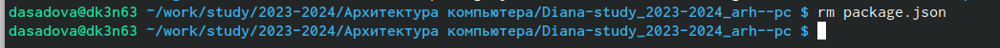

---
## Front matter
title: "Лабораторная работа No2. Система контроля версий Git"
subtitle: "Простейший вариант"
author: "Садова Диана Алексеевна"

## Generic otions
lang: ru-RU
toc-title: "Содержание"

## Bibliography
bibliography: bib/cite.bib
csl: pandoc/csl/gost-r-7-0-5-2008-numeric.csl

## Pdf output format
toc: true # Table of contents
toc-depth: 2
lof: true # List of figures
lot: true # List of tables
fontsize: 12pt
linestretch: 1.5
papersize: a4
documentclass: scrreprt
## I18n polyglossia
polyglossia-lang:
  name: russian
  options:
	- spelling=modern
	- babelshorthands=true
polyglossia-otherlangs:
  name: english
## I18n babel
babel-lang: russian
babel-otherlangs: english
## Fonts
mainfont: PT Serif
romanfont: PT Serif
sansfont: PT Sans
monofont: PT Mono
mainfontoptions: Ligatures=TeX
romanfontoptions: Ligatures=TeX
sansfontoptions: Ligatures=TeX,Scale=MatchLowercase
monofontoptions: Scale=MatchLowercase,Scale=0.9
## Biblatex
biblatex: true
biblio-style: "gost-numeric"
biblatexoptions:
  - parentracker=true
  - backend=biber
  - hyperref=auto
  - language=auto
  - autolang=other*
  - citestyle=gost-numeric
## Pandoc-crossref LaTeX customization
figureTitle: "Рис."
tableTitle: "Таблица"
listingTitle: "Листинг"
lofTitle: "Список иллюстраций"
lotTitle: "Список таблиц"
lolTitle: "Листинги"
## Misc options
indent: true
header-includes:
  - \usepackage{indentfirst}
  - \usepackage{float} # keep figures where there are in the text
  - \floatplacement{figure}{H} # keep figures where there are in the text
---

# Цель работы

Целью работы является изучить идеологию и применение средств контроля версий. Приобрести
практические навыки по работе с системой git

# Задание

## Порядок выполнения лабораторной работы

### Настройка github

Существует несколько доступных серверов репозиториев с возможностью бесплатного размещения  данных. Например, http://bitbucket.org/, https://github.com/ и https://gitflic.ru.

Для выполнения лабораторных работ предлагается использовать Github.

Создайте учётную запись на сайте https://github.com/ и заполните основные данные (рис.1.1)

{#fig:011 width=70%}

### Базовая настройка git

Сначала сделаем предварительную конфигурацию git. Откройте терминал и введите следующие команды, указав имя и email владельца репозитория (рис.1.2)

{#fig:012 width=90%}

Настроим utf-8 в выводе сообщений git (рис.1.3)

{#fig:013 width=90%}

Зададим имя начальной ветки (будем называть её master) (рис.1.4)

{#fig:014 width=90%}

Параметр autocrlf (рис.1.5)

{#fig:015 width=90%}

Настройка core.autocrlf с параметрами "true" и "input" делает все переводы строк текстовых файлов в главном репозитории одинаковы. core.autocrlf input - конвертация CRLF в LF только при коммитах

Параметр safecrlf (рис. 1.6)

{#fig:016 width=90%}

Safecrlf - Git проверяет, если преобразование является обратимым для текущей настройки
core.autocrlf. Сore.safecrlf warn - печать только предупреждение, но принимает необратимый
переход.

### Создание SSH ключа

Для последующей идентификации пользователя на сервере репозиториев необходимо сгенерировать пару ключей (приватный и открытый) (рис.1.7)

{#fig:017 width=90%}

Ключи сохраняться в каталоге ~/.ssh/.

Далее необходимо загрузить сгенерённый открытый ключ. Для этого зайти на сайт http: //github.org/ под своей учётной записью и перейти в меню Setting . После этого выбрать в боковом меню SSH and GPG keys и нажать кнопку New SSH key . Скопировав из локальной консоли ключ в буфер обмена (рис.1.8)

{#fig:018 width=90%}

Вставляем ключ в появившееся на сайте поле и указываем для ключа имя (Title). (рис.1.9)

{#fig:019 width=90%}

### Сознание рабочего пространства и репозитория курса на основе шаблона

При выполнении лабораторных работ следует придерживаться структуры рабочего
пространства. Рабочее пространство по предмету располагается в следующей иерархии:

	~/work/study/
	--- <учебный год>/
	 --- <название предмета>/
	  --- <код предмета>/

Например, для 2023–2024 учебного года и предмета «Архитектура компьютера» (код
предмета arch-pc) структура каталогов примет следующий вид:

	~/work/study/
	 --- 2023–2024/
	  --- Архитектура компьютера/
	   --- arch-pc/
	    --- labs/
	       --- lab01/
	       --- lab02/
	       --- lab03/
	       ...

• Каталог для лабораторных работ имеет вид labs.

• Каталоги для лабораторных работ имеют вид lab<номер>, например: lab01, lab02 и т.д.

Название проекта на хостинге git имеет вид: study_<учебный год>_<код предмета>

Например, для 2023–2024 учебного года и предмета «Архитектура компьютера» (код предмета arch-pc) название проекта примет следующий вид: study_2023–2024_arch-pc

Откройте терминал и создайте каталог для предмета «Архитектура компьютера» (рис.1.10)

{#fig:110 width=90%}

### Сознание репозитория курса на основе шаблона

Репозиторий на основе шаблона можно создать через web-интерфейс github.

Перейдите на станицу репозитория с шаблоном курса https://github.com/yamadharma/course-directory-student-template. (рис.1.11)

{#fig:111 width=90%}

Далее выберите Use this template

В открывшемся окне задайте имя репозитория (Repository name) study_2023–2024_arhpc и создайте репозиторий (кнопка Create repository from template). (рис.1.12)

{#fig:112 width=90%}

Откройте терминал и перейдите в каталог курса (рис.1.13)

{#fig:113 width=90%}

Клонируйте созданный репозиторий (рис.1.14)

{#fig:114 width=90%}

Ссылку для клонирования можно скопировать на странице созданного репозитория Code -> SSH (рис.1.15)

{#fig:115 width=90%}

### Настройка каталога курса

Перейдите в каталог курса (рис.1.16)

{#fig:116 width=90%}

Удалите лишние файлы (рис.1.17)

{#fig:117 width=90%}

Создайте необходимые каталоги (рис.1.18)

{#fig:118 width=90%}

Отправьте файлы на сервер (рис.1.19)

{#fig:119 width=90%}

{#fig:120 width=90%}

Проверьте правильность создания иерархии рабочего пространства в локальном репозитории и на странице github. (рис.1.20)

{#fig:121 width=90%}

# Выполнение лабораторной работы

Создайте отчет по выполнению лабораторной работы в соответствующем каталоге рабочего пространства (labs>lab02>report). (рис.2.1)

{#fig:022 width=90%}

Скопируйте отчеты по выполнению предыдущих лабораторных работ в соответствующие каталоги созданного рабочего пространства. (рис.2.2)

{#fig:023 width=90%}

Загрузите файлы на gith

# Выводы

Я изучила идеологию и применение средств контроля версий. Приобрела практические навыки по
работе с системой git

# Список литературы{.unnumbered}

::: {#refs}
:::
