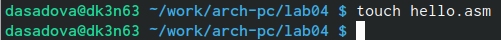
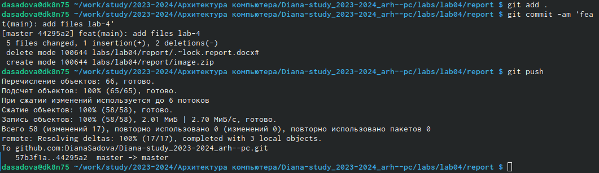

---
## Front matter
title: "Лабораторная работа №4. Создание и процесс обработки программ на языке ассемблера NASM"
subtitle: "Простейший вариант"
author: "Диана Садова Алексевна"

## Generic otions
lang: ru-RU
toc-title: "Содержание"

## Bibliography
bibliography: bib/cite.bib
csl: pandoc/csl/gost-r-7-0-5-2008-numeric.csl

## Pdf output format
toc: true # Table of contents
toc-depth: 2
lof: true # List of figures
lot: true # List of tables
fontsize: 12pt
linestretch: 1.5
papersize: a4
documentclass: scrreprt
## I18n polyglossia
polyglossia-lang:
  name: russian
  options:
	- spelling=modern
	- babelshorthands=true
polyglossia-otherlangs:
  name: english
## I18n babel
babel-lang: russian
babel-otherlangs: english
## Fonts
mainfont: PT Serif
romanfont: PT Serif
sansfont: PT Sans
monofont: PT Mono
mainfontoptions: Ligatures=TeX
romanfontoptions: Ligatures=TeX
sansfontoptions: Ligatures=TeX,Scale=MatchLowercase
monofontoptions: Scale=MatchLowercase,Scale=0.9
## Biblatex
biblatex: true
biblio-style: "gost-numeric"
biblatexoptions:
  - parentracker=true
  - backend=biber
  - hyperref=auto
  - language=auto
  - autolang=other*
  - citestyle=gost-numeric
## Pandoc-crossref LaTeX customization
figureTitle: "Рис."
tableTitle: "Таблица"
listingTitle: "Листинг"
lofTitle: "Список иллюстраций"
lotTitle: "Список таблиц"
lolTitle: "Листинги"
## Misc options
indent: true
header-includes:
  - \usepackage{indentfirst}
  - \usepackage{float} # keep figures where there are in the text
  - \floatplacement{figure}{H} # keep figures where there are in the text
---

# Цель работы

Освоение процедуры компиляции и сборки программ, написанных на ассемблере NASM.

# Задание

## Порядок выполнения лабораторной работы

### Программа Hello world!

Рассмотрим пример простой программы на языке ассемблера NASM. Традиционно первая программа выводит приветственное сообщение Hello world! на экран.

Создайте каталог для работы с программами на языке ассемблера NASM (рис.2.1)

{#fig:001 width=90%}

Перейдите в созданный каталог (рис.2.2)

{#fig:002 width=90%}

Создайте текстовый файл с именем hello.asm (рис.2.3)(рис.2.4)

{#fig:003 width=90%}

{#fig:004 width=90%}

Проверив его наличее мы удостоверились, что программа выполнена корректно. 

Откройте этот файл с помощью любого текстового редактора, например, gedit (рис.2.5)

{#fig:005 width=90%}

С помощью gedit начинаем редактировать текст для дальнейшей работы.

И введите в него следующий текст (рис.2.6)

{#fig:006 width=90%}
	
В отличие от многих современных высокоуровневых языков программирования, в ассемблерной программе каждая команда располагается на отдельной строке. Размещение нескольких команд на одной строке недопустимо. Синтаксис ассемблера NASM является чувствительным к регистру, т.е. есть разница между большими и малыми буквами.

### Транслятор NASM

NASM превращает текст программы в объектный код. Например, для компиляции приведённого выше текста программы «Hello World» необходимо написать (рис.2.7)

{#fig:007 width=90%}

Если текст программы набран без ошибок, то транслятор преобразует текст программы из файла hello.asm в объектный код, который запишется в файл hello.o. Таким образом,имена всех файлов получаются из имени входного файла и расширения по умолчанию. При наличии ошибок объектный файл не создаётся, а после запуска транслятора появятся сообщения об ошибках или предупреждения.

С помощью команды ls проверьте, что объектный файл был создан. Какое имя имеет объектный файл?

NASM не запускают без параметров. Ключ -f указывает транслятору, что требуется создать бинарные файлы в формате ELF. Следует отметить, что формат elf64 позволяет создавать исполняемый код, работающий под 64-битными версиями Linux. Для 32-битных версий ОС указываем в качестве формата просто elf. NASM всегда создаёт выходные файлы в текущем каталоге.

### Расширенный синтаксис командной строки NASM

Полный вариант командной строки nasm выглядит следующим образом:
	nasm [-@ косвенный_файл_настроек] [-o объектный_файл] [-f
	формат_объектного_файла] [-l листинг] [параметры...] [--] исходный_файл↪

Выполните следующую команду (рис.2.8)

{#fig:008 width=90%}

Данная команда скомпилирует исходный файл hello.asm в obj.o (опция -o позволяет задать имя объектного файла, в данном случае obj.o), при этом формат выходного файла будет elf, и в него будут включены символы для отладки (опция -g), кроме того, будет создан файл листинга list.lst (опция -l).

С помощью команды ls проверьте, что файлы были созданы (рис.2.9)

{#fig:009 width=90%}

Для более подробной информации см. man nasm. Для получения списка форматов объектного файла см. nasm -hf.
# Теоретическое введение

## Компоновщик LD

Как видно из схемы на рис. 4.3, чтобы получить исполняемую программу, объектный файл необходимо передать на обработку компоновщику (рис.2.10)

{#fig:010 width=90%}

Компоновщик — инструментальная программа, которая производит компоновку («линковку»): принимает на вход один или несколько объектных модулей и собирает из них исполняемый или библиотечный файл-модуль. 

С помощью команды ls проверьте, что исполняемый файл hello был создан (рис.2.11)

{#fig:011 width=90%}

Компоновщик ld не предполагает по умолчанию расширений для файлов, но принято использовать следующие расширения:
	• o – для объектных файлов;
	• без расширения – для исполняемых файлов;
	• map – для файлов схемы программы;
	• lib – для библиотек.

Ключ -o с последующим значением задаёт в данном случае имя создаваемого исполняемого файла.

Выполните следующую команду (рис.2.12)

{#fig:012 width=90%}

Какое имя будет иметь исполняемый файл? Какое имя имеет объектный файл из которого собран этот исполняемый файл?

Формат командной строки LD можно увидеть, набрав ld --help. Для получения более подробной информации см. man ld.

### Запуск исполняемого файла

Запустить на выполнение созданный исполняемый файл, находящийся в текущем каталоге, можно, набрав в командной строке (рис.2.13)

{#fig:013 width=90%}

Проверя работу программы, мы получили надпись “Hello world!”записанную в текстовый и далее преобразованный файл.

# Теоретическое введение

# Выполнение лабораторной работы

## Задание для самостоятельной работы

### В каталоге ~/work/arch-pc/lab04 с помощью команды cp создайте копию файла hello.asm с именем lab4.asm (рис.4.1)

{#fig:014 width=90%}

### С помощью любого текстового редактора внесите изменения в текст программы в файле lab4.asm так, чтобы вместо Hello world! На экран выводилась строка с вашими фамилией и именем (рис.4.2)(рис.4.3)

{#fig:015 width=90%}

{#fig:016 width=90%}

### Оттранслируйте полученный текст программы lab4.asm в объектный файл. Выполните компоновку объектного файла и запустите получившийся исполняемый файл (рис.4.4)

{#fig:017 width=90%}

### Скопируйте файлы hello.asm и lab4.asm в Ваш локальный репозиторий в каталог ~/work/study/2023-2024/"Архитектура компьютера"/arch-pc/labs/lab04/. Загрузите файлы на Github (рис.4.5)(рис.4.6)

{#fig:018 width=90%}

{#fig:019 width=90%}

# Выводы

Освоила процедуры компиляции и сборки программ, написанных на ассемблере NASM.

# Список литературы{.unnumbered}

::: {#refs}
:::
