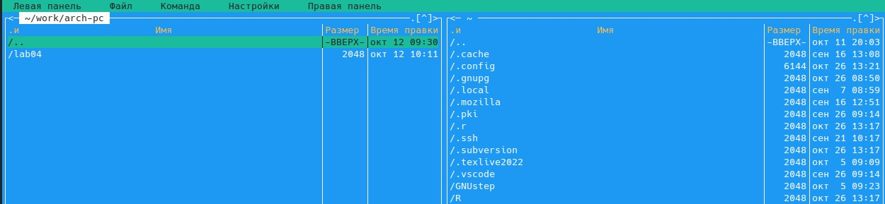
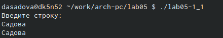

---
## Front matter
title: "Лабораторная работа No5. Основы работы с Midnight Commander (mc). Структура программы на языке ассемблера NASM. Системные вызовы в ОС GNU Linux"
subtitle: "Простейший вариант"
author: "Диана Алексеевна Садова"

## Generic otions
lang: ru-RU
toc-title: "Содержание"

## Bibliography
bibliography: bib/cite.bib
csl: pandoc/csl/gost-r-7-0-5-2008-numeric.csl

## Pdf output format
toc: true # Table of contents
toc-depth: 2
lof: true # List of figures
lot: true # List of tables
fontsize: 12pt
linestretch: 1.5
papersize: a4
documentclass: scrreprt
## I18n polyglossia
polyglossia-lang:
  name: russian
  options:
	- spelling=modern
	- babelshorthands=true
polyglossia-otherlangs:
  name: english
## I18n babel
babel-lang: russian
babel-otherlangs: english
## Fonts
mainfont: PT Serif
romanfont: PT Serif
sansfont: PT Sans
monofont: PT Mono
mainfontoptions: Ligatures=TeX
romanfontoptions: Ligatures=TeX
sansfontoptions: Ligatures=TeX,Scale=MatchLowercase
monofontoptions: Scale=MatchLowercase,Scale=0.9
## Biblatex
biblatex: true
biblio-style: "gost-numeric"
biblatexoptions:
  - parentracker=true
  - backend=biber
  - hyperref=auto
  - language=auto
  - autolang=other*
  - citestyle=gost-numeric
## Pandoc-crossref LaTeX customization
figureTitle: "Рис."
tableTitle: "Таблица"
listingTitle: "Листинг"
lofTitle: "Список иллюстраций"
lotTitle: "Список таблиц"
lolTitle: "Листинги"
## Misc options
indent: true
header-includes:
  - \usepackage{indentfirst}
  - \usepackage{float} # keep figures where there are in the text
  - \floatplacement{figure}{H} # keep figures where there are in the text
---

# Цель работы

Приобретение практических навыков работы в Midnight Commander. Освоение инструкций языка ассемблера mov и int.

# Задание

## Порядок выполнения лабораторной работы

### Откройте Midnight Commander (рис.2.1)(рис.2.2)

{#fig:001 width=90%}

{#fig:002 width=90%}

С помощью команды mc мы переходим в Midnight и продолжаем работу 

### Пользуясь клавишами вверх, вниз и Enter перейдите в каталог ~/work/arch-pc созданный при выполнении лабораторной работы No4 (рис.2.3).

{#fig:003 width=90%}

### С помощью функциональной клавиши F7 создайте папку lab05 (рис.2.4) и перейдите в созданный каталог(рис.2.5).

{#fig:004 width=90%}

{#fig:005 width=90%}

### Пользуясь строкой ввода и командой touch создайте файл lab05-1.asm (рис.2.6), (рис.2.7).

{#fig:006 width=90%}

{#fig:007 width=90%}

### С помощью функциональной клавиши F4 откройте файл lab05-1.asm для редактирования во встроенном редакторе. Как правило в качестве встроенного редактора Midnight Commander используется редакторы nano или mcedit (рис.2.8).

{#fig:008 width=90%}

### Введите текст программы из листинга 5.1 (можно без комментариев), сохраните изменения и закройте файл (рис.2.9).

Листинг 5.1. Программа вывода сообщения на экран и ввода строки с клавиатуры

{#fig:009 width=90%}

### С помощью функциональной клавиши F3 откройте файл lab05-1.asm для просмотра. Убедитесь, что файл содержит текст программы (рис.2.10).

{#fig:010 width=90%}

### Оттранслируйте текст программы lab05-1.asm в объектный файл. Выполните компоновку объектного файла и запустите получившийся исполняемый файл. Программа выводит строку 'Введите строку:' и ожидает ввода с клавиатуры. На запрос введите Ваши ФИО (рис.2.11), (рис.2.12), (рис.2.13), (рис.2.14), (рис.2.15), (рис.2.16).

{#fig:011 width=90%}

{#fig:012 width=90%}

{#fig:013 width=90%}

{#fig:014 width=90%}

{#fig:015 width=90%}

{#fig:016 width=90%}

## Подключение внешнего файла in_out.asm

Для упрощения написания программ часто встречающиеся одинаковые участки кода (такие как, например, вывод строки на экран или выход их программы) можно оформить в виде подпрограмм и сохранить в отдельные файлы, а во всех нужных местах поставить вызов нужной подпрограммы. Это позволяет сделать основную программу более удобной для написания и чтения.

NASM позволяет подключать внешние файлы с помощью директивы %include, которая предписывает ассемблеру заменить эту директиву содержимым файла. Подключаемые файлы также написаны на языке ассемблера. Важно отметить, что директива %include в тексте программы должна стоять раньше, чем встречаются вызовы подпрограмм из подключаемого файла. Для вызова подпрограммы из внешнего файла используется инструкция call,которая имеет следующий вид

	call <function>

где function имя подпрограммы.

Для выполнения лабораторных работ используется файл in_out.asm1, который содержит следующие подпрограммы [4]:
	
	• slen – вычисление длины строки (используется в подпрограммах печати сообщения для определения количества выводимых байтов);
	• sprint – вывод сообщения на экран, перед вызовом sprint в регистр eax необходимо записать выводимое сообщение (mov eax,<message>);
	• sprintLF – работает аналогично sprint, но при выводе на экран добавляет к сообщению символ перевода строки;
	• sread – ввод сообщения с клавиатуры, перед вызовом sread в регистр eax необходимо записать адрес переменной в которую введенное сообщение буд записано (mov eax,<buffer>) , в регистр ebx – длину вводимой строки (mov ebx,<N>); 1Файл in_out.asm можно скачать на странице курса в ТУИС.
	• iprint – вывод на экран чисел в формате ASCII, перед вызовом iprint в регистр eax необходимо записать выводимое число (mov eax,<int>);
	• iprintLF – работает аналогично iprint, но при выводе на экран после числа добавляет к символ перевода строки;
	• atoi – функция преобразует ascii-код символа в целое число и записыает результат в регистр eax, перед вызовом atoi в регистр eax необходимо записать число (mov eax,<int>);
	• quit – завершение программы.

### Скачайте файл in_out.asm со страницы курса в ТУИС (рис.2.17).

{#fig:017 width=90%}

### Подключаемый файл in_out.asm должен лежать в том же каталоге, что и файл с программой, в которой он используется.

В одной из панелей mc откройте каталог с файлом lab05-1.asm. В другой панели каталог со скаченным файлом in_out.asm (для перемещения между панелями используйте Tab ).Скопируйте файл in_out.asm в каталог с файлом lab05-1.asm с помощью функциональной клавиши F5 (рис.2.18), (рис.2.19).

{#fig:018 width=90%}

{#fig:019 width=90%}

Рис. 5.7. Окно Midnight Commander. Копирование файла

### С помощью функциональной клавиши F6 создайте копию файла lab05-1.asm с именем lab05-2.asm. Выделите файл lab05-1.asm, нажмите клавишу F6 , введите имя файла lab05-2.asm и нажмите клавишу Enter (рис.2.20).

{#fig:020 width=90%}

Клавиша F6 - это клавиша для переноса файла или группы файлов из каталога, отображаемого в первой панели, в каталог, отображаемый на второй панели. Так же, возможно переписывать название файла во второй панели.

### Исправьте текст программы в файле lab05-2.asm с использование подпрограмм из внешнего файла in_out.asm (используйте подпрограммы sprintLF, sread и quit) в соответствии с листингом 5.2. Создайте исполняемый файл и проверьте его работу (рис.2.21).

Листинг 5.2. Программа вывода сообщения на экран и ввода строки с клавиатуры c использованием файла in_out.asm

{#fig:021 width=90%}

### В файле lab5-2.asm замените подпрограмму sprintLF на sprint. Создайте исполняемый файл и проверьте его работу. В чем разница? (рис.2.22)

{#fig:022 width=90%}

Ответ на вопрос: Мы записываем наши данные не на следующей строке, а после двоеточия

# Теоретическое введение

# Выполнение лабораторной работы

## Задание для самостоятельной работы

### Создайте копию файла lab5-1.asm. Внесите изменения в программу (без использования внешнего файла in_out.asm), так чтобы она работала по следующему алгоритму: (рис.2.23), (рис.2.24)
	
	• вывести приглашение типа “Введите строку:”;
	• ввести строку с клавиатуры;
	• вывести введённую строку на экран.

{#fig:023 width=90%}

{#fig:024 width=90%}

### Получите исполняемый файл и проверьте его работу. На приглашение ввести строку введите свою фамилию (рис.2.25).

{#fig:025 width=90%}

### Создайте копию файла lab5-2.asm. Исправьте текст программы с использование подпрограмм из внешнего файла in_out.asm, так чтобы она работала по следующему алгоритму: (рис.2.26), (рис.2.27)
	
	• вывести приглашение типа “Введите строку:”;
	• ввести строку с клавиатуры;
	• вывести введённую строку на экран.
	
{#fig:026 width=90%}

{#fig:027 width=90%}

### Создайте исполняемый файл и проверьте его работу (рис.2.28).

{#fig:028 width=90%}

# Выводы

Приобретенны практические навыкы работы в Midnight Commander. Освоянны инструкции
языка ассемблера mov и int.

# Список литературы{.unnumbered}

::: {#refs}
:::
