---
## Front matter
title: "Шаблон отчёта по лабораторной работе"
subtitle: "Простейший вариант"
author: "Дмитрий Сергеевич Кулябов"

## Generic otions
lang: ru-RU
toc-title: "Содержание"

## Bibliography
bibliography: bib/cite.bib
csl: pandoc/csl/gost-r-7-0-5-2008-numeric.csl

## Pdf output format
toc: true # Table of contents
toc-depth: 2
lof: true # List of figures
lot: true # List of tables
fontsize: 12pt
linestretch: 1.5
papersize: a4
documentclass: scrreprt
## I18n polyglossia
polyglossia-lang:
  name: russian
  options:
	- spelling=modern
	- babelshorthands=true
polyglossia-otherlangs:
  name: english
## I18n babel
babel-lang: russian
babel-otherlangs: english
## Fonts
mainfont: PT Serif
romanfont: PT Serif
sansfont: PT Sans
monofont: PT Mono
mainfontoptions: Ligatures=TeX
romanfontoptions: Ligatures=TeX
sansfontoptions: Ligatures=TeX,Scale=MatchLowercase
monofontoptions: Scale=MatchLowercase,Scale=0.9
## Biblatex
biblatex: true
biblio-style: "gost-numeric"
biblatexoptions:
  - parentracker=true
  - backend=biber
  - hyperref=auto
  - language=auto
  - autolang=other*
  - citestyle=gost-numeric
## Pandoc-crossref LaTeX customization
figureTitle: "Рис."
tableTitle: "Таблица"
listingTitle: "Листинг"
lofTitle: "Список иллюстраций"
lotTitle: "Список таблиц"
lolTitle: "Листинги"
## Misc options
indent: true
header-includes:
  - \usepackage{indentfirst}
  - \usepackage{float} # keep figures where there are in the text
  - \floatplacement{figure}{H} # keep figures where there are in the text
---

# Цель работы

Освоение арифметических инструкций языка ассемблера NASM.

# Задание

## Порядок выполнения лабораторной работы

### Символьные и численные данные в NASM

#### Создайте каталог для программам лабораторной работы No 6, перейдите в него и создайте файл lab6-1.asm:(рис.2.1), (рис.2.2)

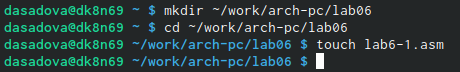{#fig:001 width=70%}

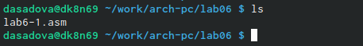{#fig:002 width=70%}

#### Рассмотрим примеры программ вывода символьных и численных значений. Программы будут выводить значения записанные в регистр eax.

Введите в файл lab6-1.asm текст программы из листинга 6.1. В данной программе в регистр eax записывается символ 6 (mov eax,'6'), в регистр ebx символ 4 (mov ebx,'4'). Далее к значению в регистре eax прибавляем значение регистра ebx (add eax,ebx, результат сложения запишется в регистр eax). Далее выводим результат. Так как для работы функции sprintLF в регистр eax должен быть записан адрес, необходимо использовать дополнительную переменную. Для этого запишем значение регистра eax в переменную buf1(mov [buf1],eax), а затем запишем адрес переменной buf1 в регистр eax (mov eax,buf1) и вызовем функцию sprintLF. (рис.2.3)

Листинг 6.1. Программа вывода значения регистра eax

{#fig:003 width=70%}

Создайте исполняемый файл и запустите его.(рис.2.4)

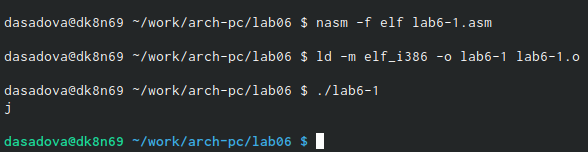{#fig:004 width=70%}

В данном случае при выводе значения регистра eax мы ожидаем увидеть число 10. Однако результатом будет символ j. Это происходит потому, что код символа 6 равен 00110110 в двоичном представлении (или 54 в десятичном представлении), а код символа 4 – 00110100 (52). Команда add eax,ebx запишет в регистр eax сумму кодов – 01101010 (106), что в свою очередь является кодом символа j (см. таблицу ASCII в приложении).

#### Далее изменим текст программы и вместо символов, запишем в регистры числа. Исправьте текст программы (Листинг 6.1) следующим образом: замените строки

    mov eax,'6'
    mov ebx,'4'

    на строки

    mov eax,6
    mov ebx,4

Создайте исполняемый файл и запустите его.

Как и в предыдущем случае при исполнении программы мы не получим число 10. В данном случае выводится символ с кодом 10. Пользуясь таблицей ASCII определите какому символу соответствует код 10. Отображается ли этот символ при выводе на экран? (рис.2.5)

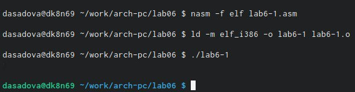{#fig:005 width=70%}

В этом случае, на экране появляется пустая строка. Это и будет нашим ответом

#### Как отмечалось выше, для работы с числами в файле in_out.asm реализованы подпрограммы для преобразования ASCII символов в числа и обратно. Преобразуем текст программы из Листинга 6.1 с использованием этих функций.

Создайте файл lab6-2.asm в каталоге ~/work/arch-pc/lab06 и введите в него текст программы из листинга 6.2.(рис.2.6), (рис.2.7)

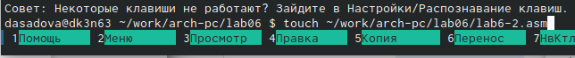{#fig:006 width=70%}

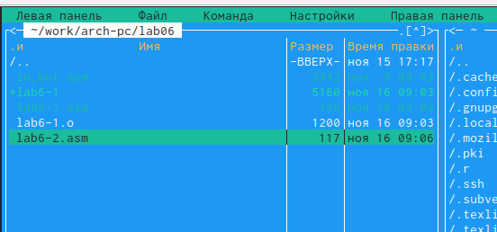{#fig:007 width=70%}

Листинг 6.2. Программа вывода значения регистра eax (рис.2.8)

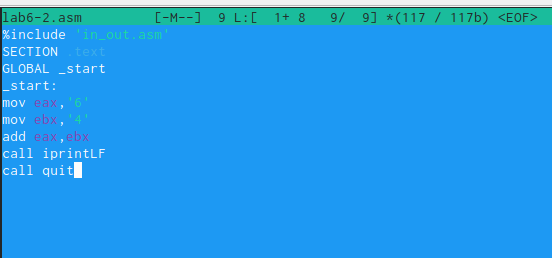{#fig:008 width=70%}

Создайте исполняемый файл и запустите его.(рис.2.9)

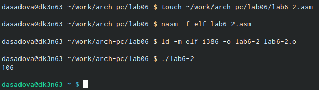{#fig:009 width=70%}

В результате работы программы мы получим число 106. В данном случае, как и в первом, команда add складывает коды символов ‘6’ и ‘4’ (54+52=106). Однако, в отличии от программы из листинга 6.1, функция iprintLF позволяет вывести число, а не символ, кодом которого является это число.

#### Аналогично предыдущему примеру изменим символы на числа. Замените строки

    mov eax,'6'
    mov ebx,'4'

    на строки

    mov eax,6
    mov ebx,4

Создайте исполняемый файл и запустите его. Какой результат будет получен при исполнении программы?(рис.2.10)

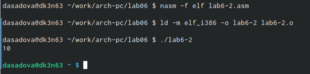{#fig:010 width=70%}

В этом случае, мы складываем сами символы 6+4 = 10. В ответ идет 10

Замените функцию iprintLF на iprint. Создайте исполняемый файл и запустите его. Чем отличается вывод функций iprintLF и iprint?(рис.2.11)

{#fig:011 width=70%}

В этом случае, после того как мы записываем ответ сразу всплывает строка для вводы следующий команды

### Выполнение арифметических операций в NASM
#### В качестве примера выполнения арифметических операций в NASM приведем программу вычисления арифметического выражения 𝑓(𝑥) = (5 ∗ 2 + 3)/3.

Создайте файл lab6-3.asm в каталоге ~/work/arch-pc/lab06: (рис.2.12),(рис.2.13)

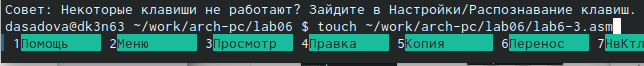{#fig:012 width=70%}

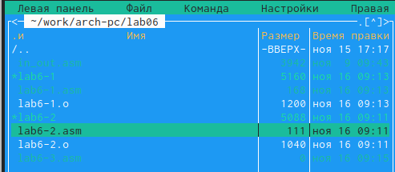{#fig:013 width=70%}

Внимательно изучите текст программы из листинга 6.3 и введите в lab6-3.asm.

Листинг 6.3. Программа вычисления выражения 𝑓(𝑥) = (5 ∗ 2 + 3)/3 (рис.2.14)

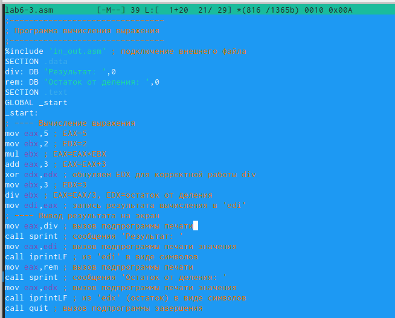{#fig:014 width=70%}

Создайте исполняемый файл и запустите его. Результат работы программы должен быть следующим:(рис.2.15)

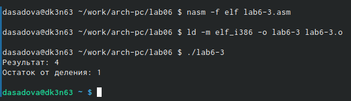{#fig:015 width=70%}

Измените текст программы для вычисления выражения 𝑓(𝑥) = (4 ∗ 6 + 2)/5. Создайте исполняемый файл и проверьте его работу.(рис.2.16), (рис.2.17)

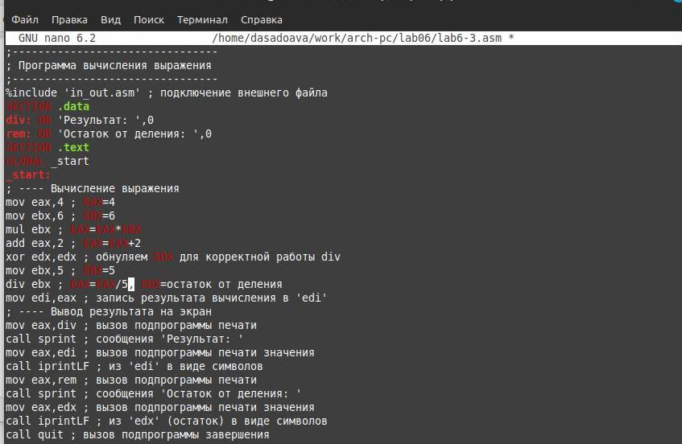{#fig:016 width=70%}

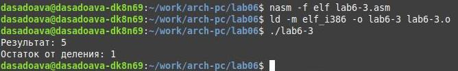{#fig:017 width=70%}

#### В качестве другого примера рассмотрим программу вычисления варианта задания по номеру студенческого билета, работающую по следующему алгоритму:
	
	• вывести запрос на введение No студенческого билета
	• вычислить номер варианта по формуле: (𝑆𝑛 mod 20) + 1, где 𝑆𝑛 – номер студенческого билета (В данном случае 𝑎 mod 𝑏 – это остаток от деления 𝑎 на 𝑏).
	• вывести на экран номер варианта.

В данном случае число, над которым необходимо проводить арифметические операции, вводится с клавиатуры. Как отмечалось выше ввод с клавиатуры осуществляется в символьном виде и для корректной работы арифметических операций в NASM символы необходимо преобразовать в числа. Для этого может быть использована функция atoi из файла in_out.asm.

Создайте файл variant.asm в каталоге ~/work/arch-pc/lab06:(рис.2.18), (рис.2.19)

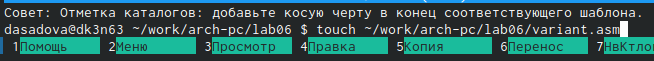{#fig:018 width=70%}

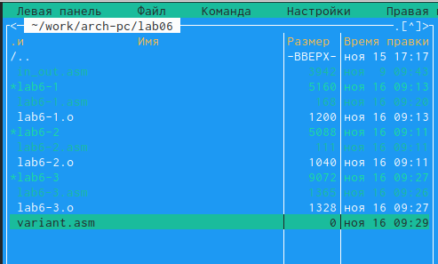{#fig:019 width=70%}

Внимательно изучите текст программы из листинга 6.4 и введите в файл variant.asm.

Листинг 6.4. Программа вычисления вычисления варианта задания по номеру студенческого билета (рис.2.20)

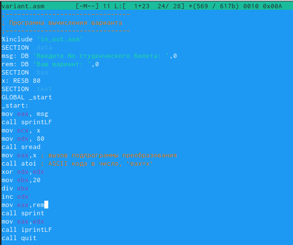{#fig:020 width=70%}

Создайте исполняемый файл и запустите его. Проверьте результат работы программы вычислив номер варианта аналитически.(рис.2.21)

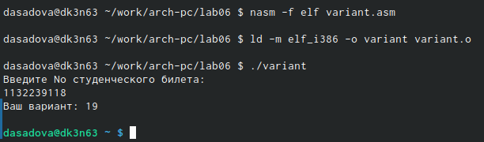{#fig:021 width=70%}

Включите в отчет по выполнению лабораторной работы ответы на следующие вопросы:
	
	1. Какие строки листинга 6.4 отвечают за вывод на экран сообщения ‘Ваш вариант:’?

    Ответ: 
    rem: DB 'Ваш вариант: ',0
    mov eax,rem
    call sprint
	
    2. Для чего используется следующие инструкции?
	mov ecx, x
	mov edx, 80
	call sread

    Ответ: для обозначения х
	
    3. Для чего используется инструкция “call atoi”?

    Ответ: переводит строку в целое число 
	
    4. Какие строки листинга 6.4 отвечают за вычисления варианта?
    
    Ответ: 
    mov ebx,20
    div ebx
    inc edx
	
    5. В какой регистр записывается остаток от деления при выполнении инструкции “div ebx”?
    
    Ответ: edx

	6. Для чего используется инструкция “inc edx”?

    Ответ: используется для увеличения операнда на единицу

	7. Какие строки листинга 6.4 отвечают за вывод на экран результата вычислений?
    
    Ответ: mov eax,edx

# Теоретическое введение

# Выполнение лабораторной работы

## Написать программу вычисления выражения 𝑦 = 𝑓(𝑥). Программа должна выводить
выражение для вычисления, выводить запрос на ввод значения 𝑥, вычислять задан-
ное выражение в зависимости от введенного 𝑥, выводить результат вычислений. Вид
функции 𝑓(𝑥) выбрать из таблицы 6.3 вариантов заданий в соответствии с номером
полученным при выполнении лабораторной работы. Создайте исполняемый файл и
проверьте его работу для значений 𝑥1 и 𝑥2 из 6.3. (рис.4.1)

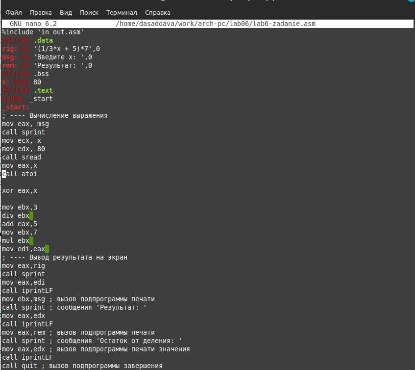{#fig:022 width=70%}

Из Листонга 6.4 мы узнали наш вариант - это 19. Первая проверка программы, при условии, что х = 3, выводит ответ 42. Вторая проверка программы, при условии, что х = 9, выводит ответ 56.

# Выводы

Освояли арифметические инструкцие языка ассемблера NASM. 

# Список литературы{.unnumbered}

::: {#refs}
:::
