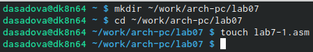

---
## Front matter
title: "Лабораторная работа №7. Команды безусловного и условного переходов в Nasm. Программирование ветвлений"
subtitle: "Простейший вариант"
author: "Диана Садова Алексеевна"

## Generic otions
lang: ru-RU
toc-title: "Содержание"

## Bibliography
bibliography: bib/cite.bib
csl: pandoc/csl/gost-r-7-0-5-2008-numeric.csl

## Pdf output format
toc: true # Table of contents
toc-depth: 2
lof: true # List of figures
lot: true # List of tables
fontsize: 12pt
linestretch: 1.5
papersize: a4
documentclass: scrreprt
## I18n polyglossia
polyglossia-lang:
  name: russian
  options:
	- spelling=modern
	- babelshorthands=true
polyglossia-otherlangs:
  name: english
## I18n babel
babel-lang: russian
babel-otherlangs: english
## Fonts
mainfont: PT Serif
romanfont: PT Serif
sansfont: PT Sans
monofont: PT Mono
mainfontoptions: Ligatures=TeX
romanfontoptions: Ligatures=TeX
sansfontoptions: Ligatures=TeX,Scale=MatchLowercase
monofontoptions: Scale=MatchLowercase,Scale=0.9
## Biblatex
biblatex: true
biblio-style: "gost-numeric"
biblatexoptions:
  - parentracker=true
  - backend=biber
  - hyperref=auto
  - language=auto
  - autolang=other*
  - citestyle=gost-numeric
## Pandoc-crossref LaTeX customization
figureTitle: "Рис."
tableTitle: "Таблица"
listingTitle: "Листинг"
lofTitle: "Список иллюстраций"
lotTitle: "Список таблиц"
lolTitle: "Листинги"
## Misc options
indent: true
header-includes:
  - \usepackage{indentfirst}
  - \usepackage{float} # keep figures where there are in the text
  - \floatplacement{figure}{H} # keep figures where there are in the text
---

# Цель работы

Изучение команд условного и безусловного переходов. Приобретение навыков написания программ с использованием переходов. Знакомство с назначением и структурой файла листинга.

# Задание

## Порядок выполнения лабораторной работы

### Реализация переходов в NASM

#### Создайте каталог для программам лабораторной работы № 7, перейдите в него и создайте файл lab7-1.asm: (рис. @fig:001), (рис. @fig:002).

{#fig:001 width=70%}

{#fig:002 width=70%}

#### Инструкция jmp в NASM используется для реализации безусловных переходов. Рассмотрим пример программы с использованием инструкции jmp. Введите в файл lab7-1.asm текст программы из листинга 7.1.

Листинг 7.1. Программа с использованием инструкции jmp(рис. @fig:003).

{#fig:003 width=70%}

Создайте исполняемый файл и запустите его. Результат работы данной программы будет следующим:(рис. @fig:004).

{#fig:004 width=70%}

Таким образом, выясняем, что программа работает корректно

Таким образом, использование инструкции jmp _label2 меняет порядок исполнения инструкций и позволяет выполнить инструкции начиная с метки _label2, пропустив вывод первого сообщения.

Инструкция jmp позволяет осуществлять переходы не только вперед но и назад. Изменим программу таким образом, чтобы она выводила сначала ‘Сообщение № 2’, потом ‘Сообщение № 1’ и завершала работу. Для этого в текст программы после вывода сообщения № 2 добавим инструкцию jmp с меткой _label1 (т.е. переход к инструкциям вывода сообщения № 1) и после вывода сообщения № 1 добавим инструкцию jmp с меткой _end (т.е. переход к инструкции call quit). Измените текст программы в соответствии с листингом 7.2.

Листинг 7.2. Программа с использованием инструкции jmp(рис. @fig:005).

{#fig:005 width=70%}

Создайте исполняемый файл и проверьте его работу.(рис. @fig:006).

{#fig:006 width=70%}

Видим, что программа работает верно

Измените текст программы добавив или изменив инструкции jmp, чтобы вывод программы был следующим:(рис. @fig:007),(рис. @fig:008).

{#fig:007 width=70%}

{#fig:008 width=70%}

Таким образом, убеждаемся, что программа работает корректно

#### Использование инструкции jmp приводит к переходу в любом случае. Однако, часто при написании программ необходимо использовать условные переходы, т.е. переход должен происходить если выполнено какое-либо условие. В качестве примера рассмотрим программу, которая определяет и выводит на экран наибольшую из 3 целочисленных переменных: A,B и C. Значения для A и C задаются в программе, значение B вводиться с клавиатуры.

Создайте файл lab7-2.asm в каталоге ~/work/arch-pc/lab07. Внимательно изучите текст программы из листинга 7.3 и введите в lab7-2.asm.(рис. @fig:009).

{#fig:009 width=70%}

Листинг 7.3. Программа, которая определяет и выводит на экран наибольшую из 3 целочисленных переменных: A,B и C.(рис. @fig:010).

{#fig:010 width=70%}

Создайте исполняемый файл и проверьте его работу для разных значений B.(рис. @fig:011).

{#fig:011 width=70%}

Видим, что программа работает верно

Обратите внимание, в данном примере переменные A и С сравниваются как символы, а переменная B и максимум из A и С как числа (для этого используется функция atoi преобразования символа в число). Это сделано для демонстрации того, как сравниваются данные. Данную программу можно упростить и сравнивать все 3 переменные как символы (т.е. не использовать функцию atoi). Однако если переменные преобразовать из символов числа, над ними можно корректно проводить арифметические операции.

### Изучение структуры файлы листинга

#### Обычно nasm создаёт в результате ассемблирования только объектный файл. Получить файл листинга можно, указав ключ -l и задав имя файла листинга в командной строке.

Создайте файл листинга для программы из файла lab7-2.asm (рис. @fig:012).

{#fig:012 width=70%}

Откройте файл листинга lab7-2.lst с помощью любого текстового редактора, например mcedit:(рис. @fig:013),(рис. @fig:014).

{#fig:013 width=70%}

{#fig:014 width=70%}

Внимательно ознакомиться с его форматом и содержимым. Подробно объяснить содержимое трёх строк файла листинга по выбору.

Подробно объясним содержание строк 5,8,9 (рис. @fig:015).

{#fig:015 width=70%}

1) 5 - Номер строки файла листинга 
00000001 - Адрес (смешение машинного кода от начала текущего сегмента)
89С3 - Машинный код (ассемблированная исходная строка в виде шестнадцатеричной последовательности)
mov ebx,eax - Исходный код программы (в данной строке идет перемешение значения eax в ebx)

2) 8 - Номер строки файла листинга
00000003 - Адрес (смешение машинного кода от начала текущего сегмента)
803800 - Машинный код (ассемблированная исходная строка в виде шестнадцатеричной последовательности)
cmp byte [eax],0 - Исходный код программы (в данной строке идет сравнение значение байта, на который указывает eax, и 0)

3) 9 - Номер строки файла листинга
00000006 - Адрес (смешение машинного кода от начала текущего сегмента)
7403 - Машинный код (ассемблированная исходная строка в виде шестнадцатеричной последовательности)
jz finished - Исходный код программы (в данной строке используем jz для перехода в finished)

Откройте файл с программой lab7-2.asm и в любой инструкции с двумя операндами удалить один операнд. Выполните трансляцию с получением файла листинга:(рис. @fig:016),(рис. @fig:017).

{#fig:016 width=70%}

{#fig:017 width=70%}

Какие выходные файлы создаются в этом случае? Что добавляется в листинге?

После выполнение трансляции на экране появляется ошибка. В полученном файле лискинга также возникает строчка об ошибке в том месте где мы удалили один из операндов (рис. @fig:018).

{#fig:018 width=70%}

# Теоретическое введение

# Выполнение лабораторной работы

### Напишите программу нахождения наименьшей из 3 целочисленных переменных a, b и c. Значения переменных выбрать из табл. 7.5 в соответствии с вариантом, полученным при выполнении лабораторной работы № 7. Создайте исполняемый файл и проверьте его работу.

Для дальнейшей работы создадим файл lab7-zadanie1.asm  и продолжим работать в нем. Мой вариант в предыдущей лабораторной работе был 19, так что я начала писать программу используя значения из 19 номера (рис. @fig:019),(рис. @fig:020),(рис. @fig:021)

{#fig:019 width=70%}

{#fig:0120 width=70%}

{#fig:021 width=70%}

### Напишите программу, которая для введенных с клавиатуры значений x и a вычисляет значение заданной функции f(x) и выводит результат вычислений. Вид функции f(x) выбрать из таблицы 7.6 вариантов заданий в соответствии с вариантом, полученным при выполнении лабораторной работы № 7. Создайте исполняемый файл и проверьте его работу для значений x и a из 7.6.

Для дальнейшей работы создадим файл lab7-zadanie2.asm  и продолжим работать в нем. Мой вариант в предыдущей лабораторной работе был 19, так что я начала писать программу используя значения из 19 номера. При решение буду использовать jg (a>b ;Переход если больше)(рис. @fig:022),(рис. @fig:023),(рис. @fig:024)

{#fig:022 width=70%}

{#fig:023 width=70%}

{#fig:023 width=70%}

# Выводы

Изучили команды условного и безусловного переходов. Приобрили навыков написания программ с использованием переходов. Познакомились с назначением и структурой файла листинга.

# Список литературы{.unnumbered}

::: {#refs}
:::
