---
## Front matter
title: "Лабораторная работа №8. Программирование цикла. Обработка аргументов командной строки"
subtitle: "Простейший вариант"
author: "Диана Садова Алексеевна"

## Generic otions
lang: ru-RU
toc-title: "Содержание"

## Bibliography
bibliography: bib/cite.bib
csl: pandoc/csl/gost-r-7-0-5-2008-numeric.csl

## Pdf output format
toc: true # Table of contents
toc-depth: 2
lof: true # List of figures
lot: true # List of tables
fontsize: 12pt
linestretch: 1.5
papersize: a4
documentclass: scrreprt
## I18n polyglossia
polyglossia-lang:
  name: russian
  options:
	- spelling=modern
	- babelshorthands=true
polyglossia-otherlangs:
  name: english
## I18n babel
babel-lang: russian
babel-otherlangs: english
## Fonts
mainfont: PT Serif
romanfont: PT Serif
sansfont: PT Sans
monofont: PT Mono
mainfontoptions: Ligatures=TeX
romanfontoptions: Ligatures=TeX
sansfontoptions: Ligatures=TeX,Scale=MatchLowercase
monofontoptions: Scale=MatchLowercase,Scale=0.9
## Biblatex
biblatex: true
biblio-style: "gost-numeric"
biblatexoptions:
  - parentracker=true
  - backend=biber
  - hyperref=auto
  - language=auto
  - autolang=other*
  - citestyle=gost-numeric
## Pandoc-crossref LaTeX customization
figureTitle: "Рис."
tableTitle: "Таблица"
listingTitle: "Листинг"
lofTitle: "Список иллюстраций"
lotTitle: "Список таблиц"
lolTitle: "Листинги"
## Misc options
indent: true
header-includes:
  - \usepackage{indentfirst}
  - \usepackage{float} # keep figures where there are in the text
  - \floatplacement{figure}{H} # keep figures where there are in the text
---

# Цель работы

Приобретение навыков написания программ с использованием циклов и обработкой
аргументов командной строки.

# Задание

## Порядок выполнения лабораторной работы

### Реализация циклов в NASM

Создайте каталог для программам лабораторной работы № 8, перейдите в него и создайте файл lab8-1.asm:(рис. @fig:001).

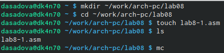{#fig:001 width=90%}

Проверили, что файл создался правильно. Приступаем к следующему пункту лабораторной работы

При реализации циклов в NASM с использованием инструкции loop необходимо помнить о том, что эта инструкция использует регистр ecx в качестве счетчика и на каждом шаге уменьшает его значение на единицу. В качестве примера рассмотрим программу, которая выводит значение регистра ecx. Внимательно изучите текст программы (Листинг 8.1),(рис. @fig:002)

Листинг 8.1. Программа вывода значений регистра ecx.

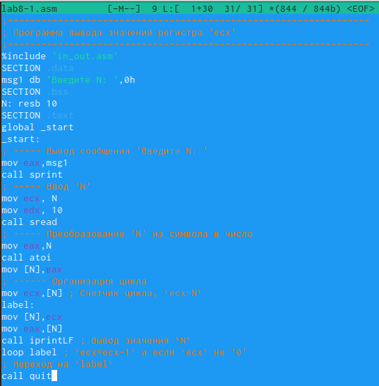{#fig:002 width=90%}

Введите в файл lab8-1.asm текст программы из листинга 8.1. Создайте исполняемый файл и проверьте его работу.(рис. @fig:003).

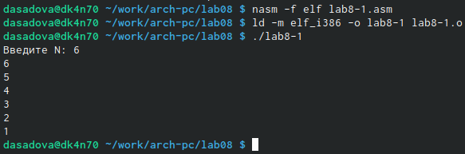{#fig:003 width=90%}

Видим, что программы работает корректно

Данный пример показывает, что использование регистра ecx в теле цикла loop может привести к некорректной работе программы. Измените текст программы добавив изменение значение регистра ecx в цикле:(рис. @fig:004).

{#fig:004 width=90%}

Создайте исполняемый файл и проверьте его работу. Какие значения принимает регистр ecx в цикле? Соответствует ли число проходов цикла значению N введенному с клавиатуры?(рис. @fig:005),(рис. @fig:006).

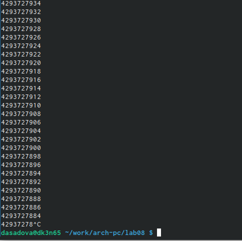{#fig:005 width=90%}

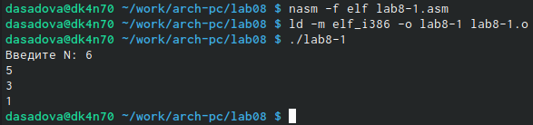{#fig:006 width=90%}

Если мы вводим не четное значение, то программа выводит не корректное значение. Если мы вводим четное число, программа выводит верные значения. В том и другом случае число N не соответствует числу проходов.

Для использования регистра ecx в цикле и сохранения корректности работы программы можно использовать стек. Внесите изменения в текст программы добавив команды push и pop (добавления в стек и извлечения из стека) для сохранения значения счетчика цикла(рис. @fig:007).

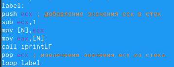{#fig:007 width=90%}

Создайте исполняемый файл и проверьте его работу. Соответствует ли в данном случае число проходов цикла значению 𝑁 введенному с клавиатуры?(рис. @fig:008).

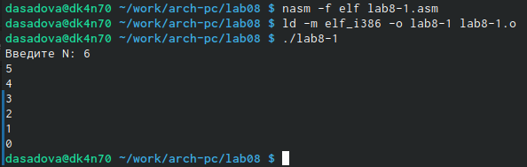{#fig:008 width=90%}

Проверяем, что программа выполняется корректно 

### Обработка аргументов командной строки

При разработке программ иногда встает необходимость указывать аргументы, которые будут использоваться в программе, непосредственно из командной строки при запуске программы.

При запуске программы в NASM аргументы командной строки загружаются в стек в обратном порядке, кроме того в стек записывается имя программы и общее количество аргументов. Последние два элемента стека для программы, скомпилированной NASM, – это всегда имя программы и количество переданных аргументов.

Таким образом, для того чтобы использовать аргументы в программе, их просто нужно
извлечь из стека. Обработку аргументов нужно проводить в цикле. Т.е. сначала нужно извлечь из стека количество аргументов, а затем циклично для каждого аргумента выполнить логику программы. В качестве примера рассмотрим программу, которая выводит на экран аргументы командной строки. Внимательно изучите текст программы (Листинг 8.2).

Листинг 8.2. Программа выводящая на экран аргументы командной строки(рис. @fig:009)

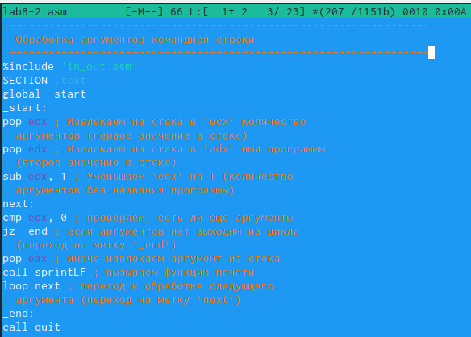{#fig:009 width=90%}

Создайте файл lab8-2.asm в каталоге ~/work/arch-pc/lab08 и введите в него текст программы из листинга 8.2.(рис. @fig:010).

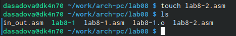{#fig:010 width=90%}

Проверяем наличия файла в каталоге можем продолжать лабораторную работу

Создайте исполняемый файл и запустите его, указав аргументы:(рис. @fig:011).

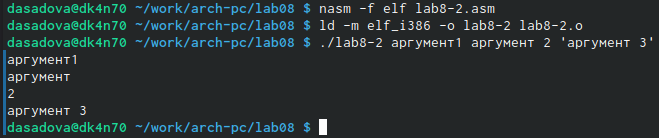{#fig:011 width=90%}

Сколько аргументов было обработано программой?

Программой было выведено 4 аргумента: 1 строка - значение "аргумента1" был вписано без пробела, вывилось на экран как один аргумент, строка 2 и 3 - значение "аргумент 2" было вписано с пробелом, вывелось как два аргумента, 4 строка - значение "'агрумент3'" изначально вводилось в скобках и программой распознавался как один аргумент.

Рассмотрим еще один пример программы которая выводит сумму чисел, которые пере даются в программу как аргументы. Создайте файл lab8-3.asm в каталоге ~/work/arch-pc/lab08 и введите в него текст программы из листинга 8.3.(рис. @fig:012).

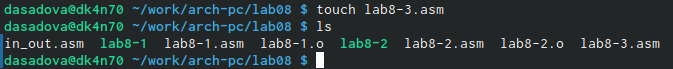{#fig:012 width=90%}

После проверки наличия файла в каталоге можем продолжать лабораторную работу

Листинг 8.3. Программа вычисления суммы аргументов командной строки(рис. @fig:013).

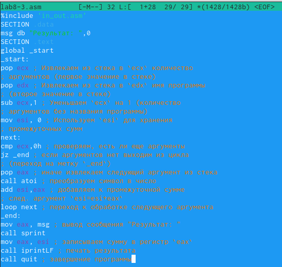{#fig:013 width=90%}

Создайте исполняемый файл и запустите его, указав аргументы. Пример результата работы программы:(рис. @fig:014).

{#fig:014 width=90%}

Измените текст программы из листинга 8.3 для вычисления произведения аргументов командной строки.(рис. @fig:015).(рис. @fig:016).

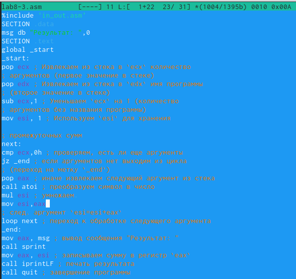{#fig:015 width=90%}

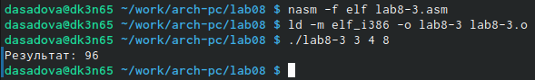{#fig:016 width=90%}

Видим, что программа выполняется корректно 

# Теоретическое введение

# Выполнение лабораторной работы

## Напишите программу, которая находит сумму значений функции f(x) для
x = x1, x2, ..., xn, т.е. программа должна выводить значение f(x1) + f(x2) + ... +f(xn). Значения xi передаются как аргументы. Вид функции f(x) выбрать из таблицы 8.1 вариантов заданий в соответствии с вариантом, полученным при выполнении лабораторной работы № 7. Создайте исполняемый файл и проверьте его работу на нескольких наборах x = x1, x2, ..., xn. Пример работы программы для функции f(x) = x + 2 и набора x1 = 1, x2 = 2, x3 = 3, x4 = 4:
    
user@dk4n31:~$ ./main 1 2 3 4
Функция: f(x)=x+2
Результат: 18
user@dk4n31:~$
    
(рис. @fig:017).(рис. @fig:018).

Мой вариант 19. При решении этого задания используем полученные навыки при решении лабораторной работы и данные 19 варианта.

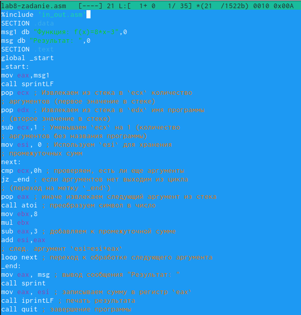{#fig:017 width=90%}

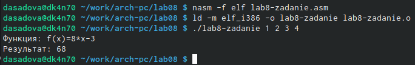{#fig:018 width=90%}

# Выводы

Мы приобрели навыки написания программ с использованием циклов и обработки
аргументов командной строки.

# Список литературы{.unnumbered}

::: {#refs}
:::
