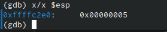

---
## Front matter
title: "Лабораторная работа №9. Понятие подпрограммы. Отладчик GDB"
subtitle: "Простейший вариант"
author: "Диана Садова Алексеевна"

## Generic otions
lang: ru-RU
toc-title: "Содержание"

## Bibliography
bibliography: bib/cite.bib
csl: pandoc/csl/gost-r-7-0-5-2008-numeric.csl

## Pdf output format
toc: true # Table of contents
toc-depth: 2
lof: true # List of figures
lot: true # List of tables
fontsize: 12pt
linestretch: 1.5
papersize: a4
documentclass: scrreprt
## I18n polyglossia
polyglossia-lang:
  name: russian
  options:
	- spelling=modern
	- babelshorthands=true
polyglossia-otherlangs:
  name: english
## I18n babel
babel-lang: russian
babel-otherlangs: english
## Fonts
mainfont: PT Serif
romanfont: PT Serif
sansfont: PT Sans
monofont: PT Mono
mainfontoptions: Ligatures=TeX
romanfontoptions: Ligatures=TeX
sansfontoptions: Ligatures=TeX,Scale=MatchLowercase
monofontoptions: Scale=MatchLowercase,Scale=0.9
## Biblatex
biblatex: true
biblio-style: "gost-numeric"
biblatexoptions:
  - parentracker=true
  - backend=biber
  - hyperref=auto
  - language=auto
  - autolang=other*
  - citestyle=gost-numeric
## Pandoc-crossref LaTeX customization
figureTitle: "Рис."
tableTitle: "Таблица"
listingTitle: "Листинг"
lofTitle: "Список иллюстраций"
lotTitle: "Список таблиц"
lolTitle: "Листинги"
## Misc options
indent: true
header-includes:
  - \usepackage{indentfirst}
  - \usepackage{float} # keep figures where there are in the text
  - \floatplacement{figure}{H} # keep figures where there are in the text
---

# Цель работы

Приобретение навыков написания программ с использованием подпрограмм. Знакомство
с методами отладки при помощи GDB и его основными возможностями.

# Задание

## Порядок выполнения лабораторной работы

### Реализация подпрограмм в NASM

#### Создайте каталог для выполнения лабораторной работы № 9, перейдите в него и создайте файл lab09-1.asm: (рис. @fig:001).

{#fig:001 width=90%}

#### В качестве примера рассмотрим программу вычисления арифметического выражения f(x) = 2x + 7 с помощью подпрограммы _calcul. В данном примере x вводится с клавиатуры, а само выражение вычисляется в подпрограмме. Внимательно изучите текст программы (Листинг 9.1).

Листинг 9.1. Пример программы с использованием вызова подпрограммы (рис. @fig:002).

{#fig:002 width=90%}

Первые строки программы отвечают за вывод сообщения на экран (call sprint), чтение данных введенных с клавиатуры (call sread) и преобразования введенных данных из символьного вида в численный (call atoi).

mov eax, msg 

call sprint 

mov ecx, x

mov edx, 80

call sread 

mov eax,x 

call atoi

После следующей инструкции call _calcul, которая передает управление подпрограмме _calcul, будут выполнены инструкции подпрограммы:

mov ebx,2

mul ebx

add eax,7

mov [res],eax

ret

Инструкция ret является последней в подпрограмме и ее исполнение приводит к возвращению в основную программу к инструкции, следующей за инструкцией call, которая вызвала данную подпрограмму.

Последние строки программы реализую вывод сообщения (call sprint), результата вычисления (call iprintLF) и завершение программы (call quit).

Введите в файл lab09-1.asm текст программы из листинга 9.1. Создайте исполняемый файл и проверьте его работу.(рис. @fig:003).

{#fig:003 width=90%}

Убедились, что код работает верно 

Измените текст программы, добавив подпрограмму _subcalcul в подпрограмму _calcul, для вычисления выражения f(g(x)), где x вводится с клавиатуры, f(x) = 2x + 7, g(x) = 3x − 1. Т.е. x передается в подпрограмму _calcul из нее в подпрограмму _subcalcul, где вычисляется выражение g(x), результат возвращается в _calcul и вычисляется выражение f(g(x)). Результат возвращается в основную программу для вывода результата на экран.(рис. @fig:004),(рис. @fig:005).

{#fig:004 width=90%}

{#fig:005 width=90%}

Код работает исправно, можно преступать к следующему пункту

### Отладка программам с помощью GDB

Создайте файл lab09-2.asm с текстом программы из Листинга 9.2. (Программа печати сообщения Hello world!):(рис. @fig:006).

{#fig:006 width=90%}

Листинг 9.2. Программа вывода сообщения Hello world!(рис. @fig:007).

{#fig:007 width=90%}

Получите исполняемый файл. Для работы с GDB в исполняемый файл
необходимо добавить отладочную информацию, для этого трансляцию программ необходимо проводить с ключом ‘-g’.

Загрузите исполняемый файл в отладчик gdb:(рис. @fig:008).

{#fig:008 width=90%}

Проверьте работу программы, запустив ее в оболочке GDB с помощью команды run (сокращённо r):(рис. @fig:009).

{#fig:009 width=90%}

Для более подробного анализа программы установите брейкпоинт на метку _start, с которой начинается выполнение любой ассемблерной программы, и запустите её.(рис. @fig:010).

{#fig:010 width=90%}

Посмотрите дисассимилированный код программы с помощью команды disassemble начиная с метки _start(рис. @fig:011).

{#fig:011 width=90%}

Переключитесь на отображение команд с Intel’овским синтаксисом, введя команду set disassembly-flavor intel(рис. @fig:012).

{#fig:012 width=90%}

Перечислите различия отображения синтаксиса машинных команд в режимах ATT и Intel.

1. Непосредственные опеpанды AT&T пишутся после $ непосредственные операнды Intel не выделяются. 

2. Регистровые операнды AT&T пишутся после %; регистровые операнды Intel не выделяются. 

3. Абсолютные операнды AT&T jump/call пишутся после *; они не выделяются в синтаксисе Intel. 

Включите режим псевдографики для более удобного анализа программы (рис. @fig:013),(рис. @fig:014):

{#fig:013 width=90%}

{#fig:014 width=90%}

В этом режиме есть три окна:

    • В верхней части видны названия регистров и их текущие значения;
    
    • В средней части виден результат дисассимилирования программы;
    
    • Нижняя часть доступна для ввода команд.

### Добавление точек останова

Установить точку останова можно командой break (кратко b). Типичный аргумент этой команды — место установки. Его можно задать или как номер строки программы (имеет смысл, если есть исходный файл, а программа компилировалась с информацией об отладке), или как имя метки, или как адрес. Чтобы не было путаницы с номерами, перед адресом ставится «звёздочка»:

На предыдущих шагах была установлена точка останова по имени метки (_start). Проверьте это с помощью команды info breakpoints (кратко i b) (рис. @fig:015).

{#fig:015 width=90%}

Установим еще одну точку останова по адресу инструкции. Адрес инструкции можно увидеть в средней части экрана в левом столбце соответствующей инструкции. 

Определите адрес предпоследней инструкции (mov ebx,0x0) и установите точку останова (рис. @fig:016).

Посмотрите информацию о всех установленных точках останова (рис. @fig:016).

{#fig:016 width=90%}

### Работа с данными программы в GDB

Отладчик может показывать содержимое ячеек памяти и регистров, а при необходимости позволяет вручную изменять значения регистров и переменных.

Выполните 5 инструкций с помощью команды stepi (или si) и проследите за изменением значений регистров. Значения каких регистров изменяются?

Ответ:регистров eax,ebx,ecx,edx 

Посмотреть содержимое регистров также можно с помощью команды info registers (или i r).

Для отображения содержимого памяти можно использовать команду x "<"адрес">", которая выдаёт содержимое ячейки памяти по указанному адресу. Формат, в котором выводятся данные, можно задать после имени команды через косую черту: x/NFU "<"адрес">".

С помощью команды x & "<"имя переменной">" также можно посмотреть содержимое переменной.

Посмотрите значение переменной msg1 по имени.

(gdb) x/1sb &msg1

0x804a000 $<msg1>$: "Hello, "

Посмотрите значение переменной msg2 по адресу. Адрес переменной можно определить по дизассемблированной инструкции. Посмотрите инструкцию mov ecx,msg2 которая записывает в регистр ecx адрес перемененной msg2 (рис. @fig:017).

{#fig:017 width=90%}

Изменить значение для регистра или ячейки памяти можно с помощью команды set, задав ей в качестве аргумента имя регистра или адрес. При этом перед именем регистра ставится префикс $, а перед адресом нужно указать в фигурных скобках тип данных (размер сохраняемого значения; в качестве типа данных можно использовать типы языка Си). Измените первый символ переменной msg1 (рис. @fig:018).

{#fig:018 width=90%}

Замените любой символ во второй переменной msg2.

Чтобы посмотреть значения регистров используется команда print /F <val> (перед именем регистра обязательно ставится префикс $):

p/F $ "<"регистр">"

Выведете в различных форматах (в шестнадцатеричном формате, в двоичном формате и в символьном виде) значение регистра edx.

С помощью команды set измените значение регистра ebx (рис. @fig:019).

{#fig:019 width=90%}

Объясните разницу вывода команд p/s $ebx.

В p/s $ebx ='2' мы вводим значение в шестнадцатеричном формате и у нас выходит $1 = 50

Но p/s $ebx =2 мы вводим как значение в символьном виде, у нас идет перезапись и выходит $3 = 2

Завершите выполнение программы с помощью команды continue (сокращенно c) или stepi (сокращенно si) и выйдите из GDB с помощью команды quit (сокращенно q) (рис. @fig:020),(рис. @fig:021).

{#fig:020 width=90%}

{#fig:021 width=90%}

### Обработка аргументов командной строки в GDB

Скопируйте файл lab8-2.asm, созданный при выполнении лабораторной работы №8, с программой выводящей на экран аргументы командной строки (Листинг 8.2) в файл с именем lab09-3.asm (рис. @fig:022).

{#fig:022 width=90%}

Создайте исполняемый файл (рис. @fig:023).

{#fig:023 width=90%}

Для загрузки в gdb программы с аргументами необходимо использовать ключ --args. Загрузите исполняемый файл в отладчик, указав аргументы (рис. @fig:024).

{#fig:024 width=90%}

Как отмечалось в предыдущей лабораторной работе, при запуске программы аргументы командной строки загружаются в стек. Исследуем расположение аргументов командной строки в стеке после запуска программы с помощью gdb.

Для начала установим точку останова перед первой инструкцией в программе и запустим ее (рис. @fig:025).

{#fig:025 width=90%}

Адрес вершины стека храниться в регистре esp и по этому адресу располагается число равное количеству аргументов командной строки (включая имя программы) (рис. @fig:026).

{#fig:026 width=90%}

Как видно, число аргументов равно 5 – это имя программы lab09-3 и непосредственно аргументы: аргумент1, аргумент, 2 и 'аргумент 3'.

Посмотрите остальные позиции стека – по адесу [esp+4] располагается адрес в памяти где находиться имя программы, по адесу [esp+8] храниться адрес первого аргумента, по аресу [esp+12] – второго и т.д.(рис. @fig:027).

{#fig:027 width=90%}

Объясните, почему шаг изменения адреса равен 4 ([esp+4], [esp+8], [esp+12] и т.д.

Ответ:потому что размер слова (или размер указателя) составляет 4 байта. И так как мы обращаемся к следующему элементу, наше значение всегда увеличивается на это 4 бвйта.

# Теоретическое введение

# Выполнение лабораторной работы

## Задание для самостоятельной работы

### Преобразуйте программу из лабораторной работы №8 (Задание №1 для самостоятельной работы), реализовав вычисление значения функции f(x) как подпрограмму (рис. @fig:028),(рис. @fig:029).

{#fig:028 width=90%}

{#fig:029 width=90%}

После запуска программа работает исправна, значит можно переходить к следующему заданию

### В листинге 9.3 приведена программа вычисления выражения (3 + 2) * 4 + 5. При запуске данная программа дает неверный результат. Проверьте это. С помощью отладчика GDB, анализируя изменения значений регистров, определите ошибку и исправьте ее (рис. @fig:030),(рис. @fig:031),(рис. @fig:032),(рис. @fig:033).

{#fig:030 width=90%}

{#fig:031 width=90%}

{#fig:032 width=90%}

{#fig:033 width=90%}

Создаем файл с именем lab09-zadanie.asm - это файл с нашей дальнейшей работой. В lab09-zadanie.asm вводим код программы. Я убедилась, что в нем есть ошибка, когда запустила в первый раз, будем исправлять. Заходим в отладчик GDB и смотрим в какой именно момент случается проблема с значениями, проверяем  помощью операции si. Поняли, что ошибка случается при умножении. Переходим в код программы и устраняем ошибку. Запускаем исполняемый файл и убеждаемся, что проблема устранена.

# Выводы

Приобрели навыки написания программ с использованием подпрограмм. Познакомились с методами отладки при помощи GDB и его основными возможностями. 

# Список литературы{.unnumbered}

::: {#refs}
:::
