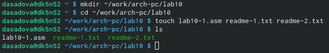
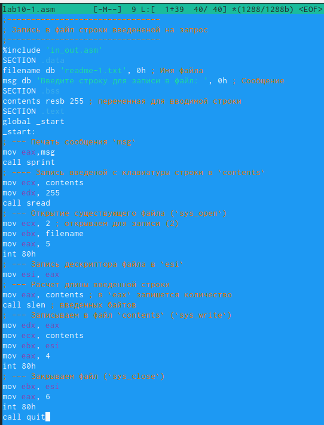
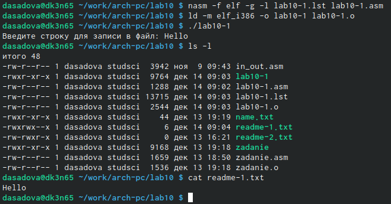
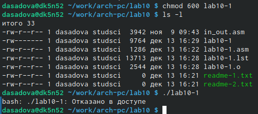
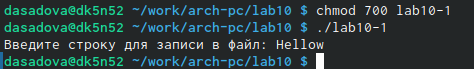
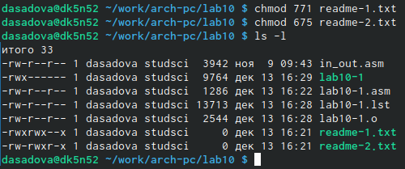
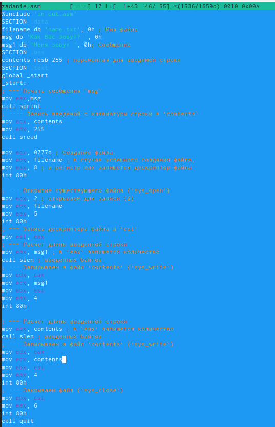
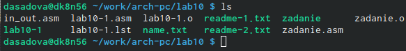

---
## Front matter
title: "Лабораторная работа №10. Работа с файлами средствами Nasm"
subtitle: "Простейший вариант"
author: "Диана Садова Алексеевна"

## Generic otions
lang: ru-RU
toc-title: "Содержание"

## Bibliography
bibliography: bib/cite.bib
csl: pandoc/csl/gost-r-7-0-5-2008-numeric.csl

## Pdf output format
toc: true # Table of contents
toc-depth: 2
lof: true # List of figures
lot: true # List of tables
fontsize: 12pt
linestretch: 1.5
papersize: a4
documentclass: scrreprt
## I18n polyglossia
polyglossia-lang:
  name: russian
  options:
	- spelling=modern
	- babelshorthands=true
polyglossia-otherlangs:
  name: english
## I18n babel
babel-lang: russian
babel-otherlangs: english
## Fonts
mainfont: PT Serif
romanfont: PT Serif
sansfont: PT Sans
monofont: PT Mono
mainfontoptions: Ligatures=TeX
romanfontoptions: Ligatures=TeX
sansfontoptions: Ligatures=TeX,Scale=MatchLowercase
monofontoptions: Scale=MatchLowercase,Scale=0.9
## Biblatex
biblatex: true
biblio-style: "gost-numeric"
biblatexoptions:
  - parentracker=true
  - backend=biber
  - hyperref=auto
  - language=auto
  - autolang=other*
  - citestyle=gost-numeric
## Pandoc-crossref LaTeX customization
figureTitle: "Рис."
tableTitle: "Таблица"
listingTitle: "Листинг"
lofTitle: "Список иллюстраций"
lotTitle: "Список таблиц"
lolTitle: "Листинги"
## Misc options
indent: true
header-includes:
  - \usepackage{indentfirst}
  - \usepackage{float} # keep figures where there are in the text
  - \floatplacement{figure}{H} # keep figures where there are in the text
---

# Цель работы

Приобретение навыков написания программ для работы с файлами.

# Задание

## Порядок выполнения лабораторной работы

### Создайте каталог для программам лабораторной работы № 10, перейдите в него и создайте файлы lab10-1.asm, readme-1.txt и readme-2.txt (рис. @fig:001).

{#fig:001 width=90%}

После проверки можем преступать к следующему пункту лабораторной работы.

### Введите в файл lab10-1.asm текст программы из листинга 10.1 (Программа записи в файл сообщения). Создайте исполняемый файл и проверьте его работу (рис. @fig:002), (рис. @fig:003).

{#fig:002 width=90%}

{#fig:003 width=90%}

### С помощью команды chmod измените права доступа к исполняемому файлу lab10-1, запретив его выполнение. Попытайтесь выполнить файл. Объясните результат (рис. @fig:004).

{#fig:004 width=90%}

С помощью 600 ( восьмеричная запись ) мы даем права на запись и чтение, но не на исполнение, компилятор не может запустить файл.

### С помощью команды chmod измените права доступа к файлу lab10-1.asm с исходным текстом программы, добавив права на исполнение. Попытайтесь выполнить его и объясните результат (рис. @fig:005).

{#fig:005 width=90%}

С помощью 700 ( восьмеричная запись ) мы даем права на запись, чтение и на исполнение, компилятор может запустить файл.

### В соответствии с вариантом в таблице 10.4 предоставить права доступа к файлу readme-1.txt представленные в символьном виде, а для файла readme-2.txt – в двочном виде. Проверить правильность выполнения с помощью команды ls -l.(рис. @fig:006)

{#fig:006 width=90%}

В предыдущих контрольных работах, я получила вариант номер 19, будем использовать данные из этого варианта для решения задания.

# Теоретическое введение

# Выполнение лабораторной работы

## Задание для самостоятельной работы

###  Напишите программу работающую по следующему алгоритму:

	• Вывод приглашения “Как Вас зовут?”
	• ввести с клавиатуры свои фамилию и имя
	• создать файл с именем name.txt
	• записать в файл сообщение “Меня зовут”
	• дописать в файл строку введенную с клавиатуры
	• закрыть файл

Описываются проведённые действия, в качестве иллюстрации даётся ссылка на иллюстрацию (рис. @fig:007),(рис. @fig:008),(рис. @fig:009).

{#fig:007 width=70%}

{#fig:008 width=70%}

{#fig:009 width=70%}

Для данного задания я создала отдельный файл с именем zadanie.asm. Открываем его и вводим программу согласно нашему алгоритму представленному в задание. Записываем и проверяем на правильность выполнение наш код. Программа работает исправна. Проверяем наличие файла name.txt.

# Выводы

Приобрели навыки написания программ для работы с файлами.

# Список литературы{.unnumbered}

::: {#refs}
:::
